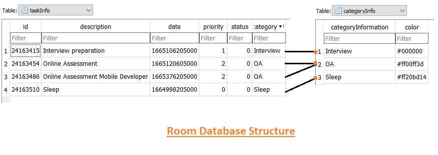

<h1>KekaToDoListApp</h1>

  
  

  
ToDoList App demonstrates modern Android development with Hilt, Coroutines, LiveData, Jetpack (Room, ViewModel), and Material 3 Design based on MVVM architecture. 

# Screenshots:
  
  
 
 
  
  
  
 

https://drive.google.com/drive/folders/1wL7O2P0zGjlRFYsc_DHJI1iKABCGEvcQ?usp=sharing
## Tech stack & Open-source libraries

// Top-level build file where you can add configuration options common to all sub-projects/modules.

buildscript {
    repositories {
        google()
    }
    dependencies {
        def nav_version = "2.5.1"
        classpath "androidx.navigation:navigation-safe-args-gradle-plugin:$nav_version"
        classpath 'com.google.dagger:hilt-android-gradle-plugin:2.38.1'
    }
}

plugins {
    id 'com.android.application' version '7.2.1' apply false
    id 'com.android.library' version '7.2.1' apply false
    id 'org.jetbrains.kotlin.android' version '1.7.0' apply false
}

task clean(type: Delete) {
    delete rootProject.buildDir
}

- Minimum SDK level 26
- [Kotlin](https://kotlinlang.org/)
  - Lifecycle: Observe Android lifecycles and handle UI states upon the lifecycle changes.
  - ViewModel: Manages UI-related data holder and lifecycle aware. Allows data to survive configuration changes such as screen rotations.
  - DataBinding: Binds UI components in your layouts to data sources in your app using a declarative format rather than programmatically.
  - Room: Constructs Database by providing an abstraction layer over SQLite to allow fluent database access.
  - Navigation Component Graphs - To use single activity multiple fragment architecture.
  - [Hilt](https://dagger.dev/hilt/): For dependency injection.
  - [Coroutines](https://github.com/Kotlin/kotlinx.coroutines) For asynchronous programming.
- Architecture
  - MVVM Architecture (View - DataBinding - ViewModel - Model)
  - Repository Pattern
- [Material-Components](https://github.com/material-components/material-components-android): Material design components for building ripple animation, and CardView.
- [ColorPicker](https://github.com/QuadFlask/colorpicker): Simple android color picker with color wheel and lightness bar.

## Architecture
**ToDoListApp** is based on the MVVM architecture and the Repository pattern, which follows the [Google's official architecture guidance](https://developer.android.com/topic/architecture).

## Room Database Structure

## Steps in order
 some of the key configurations in this file:

1.org.gradle.daemon = true: Enables the Gradle Daemon, a background process that can speed up the build process by keeping a JVM running.

2.org.gradle.jvmargs=-Xmx2048m -XX:MaxPermSize=512m -XX:+HeapDumpOnOutOfMemoryError -Dfile.encoding=UTF-8: Configures JVM arguments for Gradle. It sets the maximum heap size, PermGen size, enables heap dump on out-of-memory errors, and sets the file encoding to UTF-8.

3.org.gradle.parallel = true: Enables parallel execution of tasks, which can significantly speed up the build process.

4.org.gradle.configureondemand = true: Configures Gradle to only execute necessary project configurations, potentially reducing build times.

5.android.useAndroidX=true: Indicates the usage of AndroidX, the Android extension libraries that are part of the Android Jetpack.

6.android.enableJetifier=true: Enables Jetifier, a tool that migrates support-library-dependent libraries to use AndroidX dependencies.

7.kotlin.code.style=official: Specifies the Kotlin code style for the project, in this case, it is set to "official."

8. android.nonTransitiveRClass=true: Enables namespacing of each library's R class, reducing the size of the R class for each library.

9. org.gradle.unsafe.configuration-cache = true: Enables the experimental configuration cache for improved build performance.

Copyright@gadapwar saiprasad 2024
Thank You

